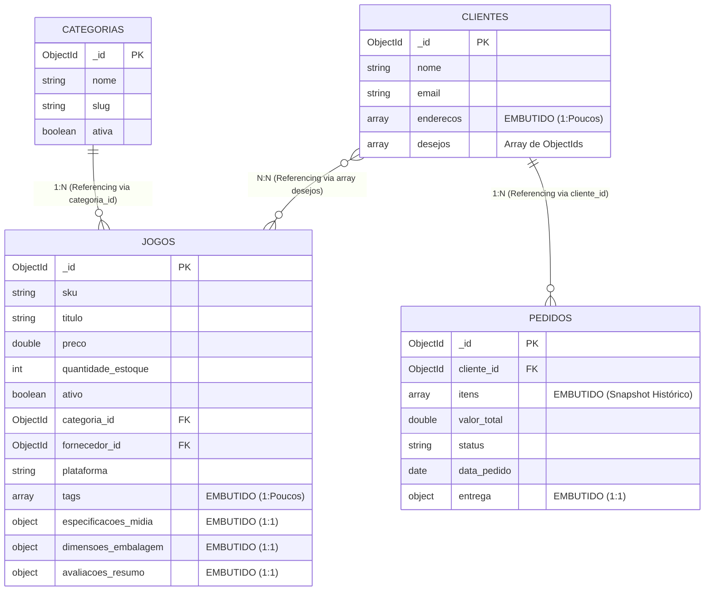

# Checkpoint 1 — E-commerce de Mídias Físicas de Jogos (RetroVault)

**Disciplina:** Banco de Dados NoSQL (TSI34E-TSI4) — UTFPR Campus Guarapuava

**Professor:** Prof. Marcelo Vichar

**Equipe:** Lucas Rosa

**Data:** 20/09/2026

---

## 1. Tema e Escopo do Sistema (15 pontos)

O **RetroVault** é uma plataforma e-commerce e marketplace especializada em mídias físicas de jogos (novas, seminovas e edições raras/de colecionador). O sistema conecta três perfis principais de usuários: **jogadores e colecionadores** (que navegam pelo catálogo, aplicam filtros técnicos de conservação, adicionam jogos ao carrinho e acompanham pedidos), **vendedores/lojas parceiras** (que gerenciam seus estoques de mídias, especificações físicas e preços) e **administradores do sistema** (que realizam a curadoria de raridades e controle das transações).

O problema central que o sistema resolve é a **tendência atual da indústria de games em extinguir as mídias físicas** em prol do modelo exclusivamente digital. O modelo digital priva os jogadores da verdadeira posse de seus jogos, deixando-os à mercê do encerramento de servidores e da remoção de títulos de bibliotecas digitais, o que ameaça diretamente a preservação histórica do ecossistema gamer. O RetroVault resolve essa dor oferecendo um ambiente seguro para compra, venda, avaliação e preservação de mídias físicas.

Do ponto de vista de banco de dados, o problema técnico abordado é a **rigidez e sobrecarga de JOINs em esquemas relacionais** ao tentar catalogar itens altamente heterogêneos. Em bancos SQL tradicionais, armazenar especificações mutáveis de mídias de diferentes gerações (ex: cartuchos de SNES com caixa/manual vs. discos de PS5) exige múltiplas tabelas normalizadas (*produtos, especificações, plataformas, edições, dimensões, fotos, avaliações*), gerando gargalos de I/O em momentos de alta concorrência.

No RetroVault, o modelo foi desenhado sob o paradigma **Query-Driven Modeling** do MongoDB: os documentos refletem diretamente a estrutura de dados consumida pela aplicação web e mobile (página do produto, vitrine e checkout), garantindo consultas de leitura atômicas e tempo de resposta sub-milissegundo.

---

## 2. Entidades e Coleções (25 pontos)

O sistema é composto por **4 coleções principais**, integrando subdocumentos embutidos e arrays com controle de tipos BSON:

### 2.1. Coleção `jogos`

Representa o catálogo de mídias físicas disponíveis para venda na plataforma.

* `_id`: ObjectId — Identificador único do jogo no catálogo.
* `sku`: String — Código único de estoque e identificação (ex: `"GAME-PS4-TLOUP1-001"`).
* `titulo`: String — Nome completo do jogo/edição.
* `descricao`: String — Detalhamento do produto e estado de conservação.
* `preco`: Number (Double) — Valor de venda em Reais.
* `quantidade_estoque`: Number (Int) — Unidades disponíveis.
* `ativo`: Boolean — Disponibilidade de exibição na loja.
* `data_cadastramento`: Date — Timestamp de inserção no sistema.
* `categoria_id`: ObjectId — Referência à categoria principal.
* `fornecedor_id`: ObjectId — Referência à loja parceira ou vendedor proprietário.
* `plataforma`: String — Console de destino (ex: `"PlayStation 4"`, `"Nintendo Switch"`).
* `tags`: Array de Strings — Palavras-chave para busca (ex: `["ps4", "exclusivo", "seminovo"]`).
* `especificacoes_midia`: Subdocumento (Objeto):
* `condicao`: String — Estado da mídia (`"Lacre de Fábrica"`, `"Seminovo"`, `"Usado"`).
* `estado_disco`: String — Estado da superfície/cartucho.
* `possui_caixa_original`: Boolean
* `possui_manual`: Boolean
* `regiao`: String — Região da mídia (ex: `"NTSC-U"`, `"PAL"`).
* `ano_lancamento`: Number (Int)


* `dimensoes_embalagem`: Subdocumento (Objeto):
* `altura_cm`: Number (Double)
* `largura_cm`: Number (Double)
* `profundidade_cm`: Number (Double)
* `peso_gramas`: Number (Int)


* `avaliacoes_resumo`: Subdocumento (Objeto):
* `media_nota`: Number (Double) — Média de 0.0 a 5.0.
* `total_avaliacoes`: Number (Int)


### 2.2. Coleção `categorias`

Representa as categorias e gêneros dos jogos no sistema.

* `_id`: ObjectId — Identificador único da categoria.
* `nome`: String — Nome da categoria (ex: `"Survival Horror"`, `"RPG"`, `"Ação e Aventura"`).
* `slug`: String — Identificador amigável para URLs (ex: `"survival-horror"`).
* `descricao`: String — Descrição breve do gênero.
* `ativa`: Boolean — Status de navegação no menu.

### 2.3. Coleção `clientes`

Representa os compradores cadastrados na plataforma.

* `_id`: ObjectId — Identificador único do cliente.
* `nome`: String — Nome completo.
* `email`: String — E-mail de autenticação (único).
* `telefone`: String — Telefone de contato.
* `enderecos`: Array de Subdocumentos — Locais de entrega cadastrados:
* `rua`: String
* `numero`: Number (Int)
* `cidade`: String
* `cep`: String
* `principal`: Boolean — Indicador do endereço padrão.


* `desejos`: Array de ObjectIds — Lista de desejos (Wishlist) com referências a `jogos`.

### 2.4. Coleção `pedidos`

Representa as transações de compra efetuadas na plataforma.

* `_id`: ObjectId — Identificador único da transação.
* `cliente_id`: ObjectId — Referência ao cliente comprador.
* `itens`: Array de Subdocumentos (Snapshot Histórico):
* `jogo_id`: ObjectId — Referência ao item original.
* `titulo`: String — Nome do jogo no momento da compra.
* `plataforma`: String — Console da mídia adquirida.
* `quantidade`: Number (Int) — Unidades compradas.
* `preco_unitario`: Number (Double) — Preço praticado no momento da transação.


* `valor_total`: Number (Double) — Valor total do pedido (itens + frete).
* `status`: String — Estado do pedido (`"pendente"`, `"pago"`, `"em_separacao"`, `"enviado"`, `"entregue"`, `"cancelado"`).
* `data_pedido`: Date — Timestamp da compra.
* `entrega`: Subdocumento (Objeto):
* `endereco_completo`: String — Endereço fixado para despacho.
* `codigo_rastreio`: String ou Null — Rastreamento dos Correios/Transportadora.
* `valor_frete`: Number (Double)


---

## 3. Modelagem: Embedding (Embutir) vs. Referencing (Referenciar) (20 pontos)

A tabela a seguir detalha a justificativa arquitetural para cada decisão de modelagem adotada no RetroVault:

| Relacionamento | Decisão Adotada | Justificativa Técnica & Trade-Offs |
| --- | --- | --- |
| **Jogo $\rightarrow$ Especificações da Mídia** | **Embedding** *(Subdocumento)* | **Relação 1:1 estrita.** As especificações de estado (caixa, manual, região, conservação do disco) pertencem exclusivamente àquela mídia física. Embutir garante leitura em I/O único na página do produto (zero JOINs). |
| **Jogo $\rightarrow$ Dimensões da Embalagem** | **Embedding** *(Subdocumento)* | **Relação 1:1 e dados imutáveis.** Usados estritamente para o cálculo de frete na finalização da compra, sem necessidade de consulta isolada. |
| **Jogo $\rightarrow$ Tags** | **Embedding** *(Array)* | **Lista curta e finita (1:Poucos).** Cada jogo possui entre 3 e 8 tags. Permite indexação multikey eficiente (`db.jogos.createIndex({ tags: 1 })`) para filtros rápidos de busca. |
| **Jogo $\rightarrow$ Categoria e Fornecedor** | **Referencing** *(ObjectIds)* | **Relação N:1 compartilhada.** Categorias e Fornecedores são entidades independentes com ciclo de vida próprio. Referenciar evita a duplicação maciça de dados e inconsistências em caso de alteração no cadastro das lojas parceiras. |
| **Cliente $\rightarrow$ Endereços de Entrega** | **Embedding** *(Array de Objetos)* | **Relação 1:Poucos com ciclo de vida acoplado.** Um cliente mantém tipicamente de 1 a 3 endereços. Todos os endereços são carregados juntos durante a etapa de checkout. |
| **Cliente $\rightarrow$ Lista de Desejos (Desejos)** | **Referencing** *(Array de ObjectIds)* | **Relação N:N de volume moderado.** Armazena apenas os `_id` dos jogos preferidos do cliente, evitando duplicar dados voláteis de estoque ou preço dentro do documento do cliente. |
| **Pedido $\rightarrow$ Itens do Pedido** | **Embedding** *(Snapshot Histórico)* | **Imutabilidade e Consistência Fiscal.** O pedido congela o estado exato da compra: mesmo que o preço do jogo mude ou o produto seja descontinuado no futuro, o pedido fechado **não pode ser alterado**. |
| **Pedido $\rightarrow$ Cliente** | **Referencing** *(ObjectId)* | **Relação N:1 clássica.** Um cliente pode realizar dezenas de compras ao longo do tempo. Embutir os dados cadastrais completos do cliente em cada pedido geraria redundância e crescimento desnecessário. |

---

## 4. Relacionamentos e Cardinalidade (15 pontos)



---

## 5. Exemplos de Documentos JSON (15 pontos)

### 5.1. Exemplo de Documento: `jogos`

```json
{
  "_id": { "$oid": "65f8a12b9f1b2c001c8e4a01" },
  "sku": "GAME-PS4-TLOUP1-001",
  "titulo": "The Last of Us Part I - Edição de Colecionador",
  "descricao": "Jogo em mídia física para PS4 em perfeito estado de conservação, incluindo luva metálica e encartes originais.",
  "preco": 249.90,
  "quantidade_estoque": 15,
  "ativo": true,
  "data_cadastramento": { "$date": "2026-03-01T10:30:00Z" },
  "categoria_id": { "$oid": "65f8999f9f1b2c001c8e4000" },
  "fornecedor_id": { "$oid": "65f89a559f1b2c001c8e4010" },
  "plataforma": "PlayStation 4",
  "tags": ["ps4", "exclusivo", "survival-horror", "seminovo", "midia-fisica"],
  "especificacoes_midia": {
    "condicao": "Seminovo",
    "estado_disco": "Excelente (Sem riscos)",
    "possui_caixa_original": true,
    "possui_manual": true,
    "regiao": "NTSC-U",
    "ano_lancamento": 2014
  },
  "dimensoes_embalagem": {
    "altura_cm": 17.0,
    "largura_cm": 13.5,
    "profundidade_cm": 1.5,
    "peso_gramas": 180
  },
  "avaliacoes_resumo": {
    "media_nota": 4.9,
    "total_avaliacoes": 42
  }
}

```

### 5.2. Exemplo de Documento: `categorias`

```json
{
  "_id": { "$oid": "65f8999f9f1b2c001c8e4000" },
  "nome": "Survival Horror",
  "slug": "survival-horror",
  "descricao": "Jogos com foco em sobrevivência, recursos escassos e tensão atmosférica.",
  "ativa": true
}

```

### 5.3. Exemplo de Documento: `clientes`

```json
{
  "_id": { "$oid": "65f8c0009f1b2c001c8e5001" },
  "nome": "Lucas Rosa",
  "email": "lucas.rosa@email.com",
  "telefone": "42999887766",
  "enderecos": [
    {
      "rua": "Rua XV de Novembro",
      "numero": 1500,
      "cidade": "Guarapuava",
      "cep": "85010-000",
      "principal": true
    }
  ],
  "desejos": [
    { "$oid": "65f8a12b9f1b2c001c8e4a01" }
  ]
}

```

### 5.4. Exemplo de Documento: `pedidos`

```json
{
  "_id": { "$oid": "65f8d1119f1b2c001c8e6001" },
  "cliente_id": { "$oid": "65f8c0009f1b2c001c8e5001" },
  "itens": [
    {
      "jogo_id": { "$oid": "65f8a12b9f1b2c001c8e4a01" },
      "titulo": "The Last of Us Part I - Edição de Colecionador",
      "plataforma": "PlayStation 4",
      "quantidade": 1,
      "preco_unitario": 249.90
    }
  ],
  "valor_total": 269.90,
  "status": "pago",
  "data_pedido": { "$date": "2026-09-10T14:20:00Z" },
  "entrega": {
    "endereco_completo": "Rua XV de Novembro, 1500 - Centro, Guarapuava-PR, CEP 85010-000",
    "codigo_rastreio": "AA123456789BR",
    "valor_frete": 20.00
  }
}

```

---

## 6. Relatórios e Indicadores de Negócio na Aplicação (10 pontos)

As consultas do Checkpoint 1 alimentam diretamente os **Controllers e Endpoints da API REST** em Node.js/TypeScript (`app/src/controllers/`), conectando ao MongoDB através do driver oficial. A validação prática é realizada via Docker através do script de inicialização (`init/mongo-init.js`) e das rotas da aplicação:

| # | Relatório / Caso de Uso | Endpoint na API | Controller Responsável | Operadores & Padrão MongoDB |
| --- | --- | --- | --- | --- |
| **1** | **Vitrine de Jogos Mais Bem Avaliados** | `GET /api/jogos/destaques` | `JogosController.listarDestaques` | Filtro com `$gte: 4.5` em subdocumento, ordenação `.sort({ "avaliacoes_resumo.media_nota": -1 })` e `.limit(5)`. |
| **2** | **Busca de Mídias em Promoção** | `GET /api/jogos/promocoes` | `JogosController.listarPromocoes` | Filtro com `$lte: 150.0`, `{ ativo: true }` e ordenação por menor preço. |
| **3** | **Fila de Expedição e Envio de Pedidos** | `GET /api/pedidos/expedicao` | `PedidosController.filaExpedicao` | Filtro de status com `$in: ["pago", "em_separacao"]` ordenado por data de compra. |
| **4** | **Atualização de Preço e Estoque do Jogo** | `PATCH /api/jogos/:sku/preco-estoque` | `JogosController.atualizarPrecoEstoque` | Atualização atômica usando o operador `$set` localizado pelo `sku`. |
| **5** | **Atualização de Status de Envio do Pedido** | `PATCH /api/pedidos/:id/status` | `PedidosController.atualizarStatus` | Atualização do fluxo do pedido (`enviado`, `entregue`) via `$set` por `_id`. |

---

### Detalhamento das Consultas nos Controllers

#### 1. Vitrine de Jogos Mais Bem Avaliados (`GET /api/jogos/destaques`)

* **Arquivo:** `app/src/controllers/jogos.controller.ts`
* **Implementação no Controller:**

```typescript
const col = getCollection("jogos");
const jogos = await col
  .find({ ativo: true, "avaliacoes_resumo.media_nota": { $gte: 4.5 } })
  .sort({ "avaliacoes_resumo.media_nota": -1 })
  .limit(5)
  .toArray();

```

#### 2. Mídias em Promoção (`GET /api/jogos/promocoes`)

* **Arquivo:** `app/src/controllers/jogos.controller.ts`
* **Implementação no Controller:**

```typescript
const col = getCollection("jogos");
const promocoes = await col
  .find({ preco: { $lte: 150.0 }, ativo: true, quantidade_estoque: { $gt: 0 } })
  .sort({ preco: 1 })
  .toArray();

```

#### 3. Fila de Expedição e Envio (`GET /api/pedidos/expedicao`)

* **Arquivo:** `app/src/controllers/pedidos.controller.ts`
* **Implementação no Controller:**

```typescript
const col = getCollection("pedidos");
const pedidos = await col
  .find({ status: { $in: ["pago", "em_separacao"] } })
  .sort({ data_pedido: 1 })
  .toArray();

```

#### 4. Atualização de Preço e Estoque (`PATCH /api/jogos/:sku/preco-estoque`)

* **Arquivo:** `app/src/controllers/jogos.controller.ts`
* **Implementação no Controller:**

```typescript
const col = getCollection("jogos");
await col.updateOne(
  { sku: req.params.sku },
  { 
    $set: { 
      preco: Number(req.body.preco),
      quantidade_estoque: Number(req.body.quantidade_estoque)
    } 
  }
);

```

#### 5. Atualização de Status do Pedido (`PATCH /api/pedidos/:id/status`)

* **Arquivo:** `app/src/controllers/pedidos.controller.ts`
* **Implementação no Controller:**

```typescript
const col = getCollection("pedidos");
await col.updateOne(
  { _id: new ObjectId(req.params.id) },
  { 
    $set: { 
      status: req.body.status,
      "entrega.codigo_rastreio": req.body.codigo_rastreio || null
    } 
  }
);

```