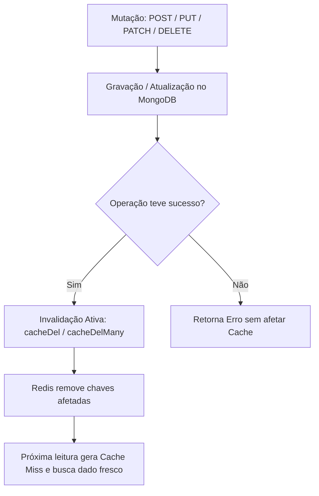

# Levantamento Técnico e Roteiro de Demonstração — Módulo 05: Redis (RetroVault)

Este documento cumpre o **Levantamento Técnico de Recursos Obrigatório** e apresenta a integração da arquitetura de cache de baixa latência em memória (*In-Memory*) com **Redis** sobre o banco de documentos **MongoDB** no e-commerce **RetroVault**.

---

## 1. Levantamento Técnico de Recursos Obrigatório

### 1.1 Identificação de Rotas Críticas (Leitura Intensiva e Pesadas)

No RetroVault, como plataforma de comércio eletrônico para mídias físicas de jogos colecionáveis e retrô, foram identificadas as seguintes consultas de altíssima frequência e peso no MongoDB:

| Rota / Endpoint | Método | Descrição e Custo no MongoDB | Frequência & Padrão de Acesso | Chave Redis Sugerida |
| :--- | :---: | :--- | :--- | :--- |
| `/api/jogos/promocoes` | `GET` | **Pesada:** Filtra mídias ativas com preço $\le 150.00$, estoque $> 0$ e ordenação por preço crescente (`sort`). Sem cache, gera I/O contínuo no disco. | **Altíssima:** Banner de topo e página de ofertas, acessada por praticamente todos os visitantes. | `retrovault:jogos:promocoes` |
| `/api/jogos/destaques` | `GET` | **Pesada:** Filtra jogos com média de avaliação $\ge 4.5$, ordenando pelas maiores notas e limitando a 5 itens para a vitrine principal. | **Crítica:** Vitrine de entrada da Home Page. Consulta feita a cada carregamento de página inicial. | `retrovault:jogos:destaques` |
| `/api/categorias` | `GET` | **Frequente:** Consulta catálogo de categorias ativas ordenadas por nome para montar o menu de navegação global. | **Muito Alta:** Consumida por todas as páginas para renderizar o Header / Navbar do e-commerce. | `retrovault:categorias:todas` |
| `/api/jogos/:sku` | `GET` | **Frequente:** Busca detalhada de um jogo por SKU (`findOne`), trazendo especificações de mídia física, conservação e histórico. | **Intensiva:** Visualização das páginas de produto por compradores. | `retrovault:jogos:sku:<sku>` |
| `/api/jogos/:sku/view` | `POST` | **Contador em Memória:** Incremento atômico de visualizações de um jogo sem gerar escritas repetitivas (`$inc`) em disco no MongoDB. | **Altíssima:** Disparada a cada visualização de produto. | `retrovault:views:<sku>` |

---

### 1.2 Definição de Políticas de TTL (Time-To-Live)

O tempo de vida de cada recurso foi dimensionado equilibrando a garantia de dados atualizados e o alívio de I/O no banco principal:

| Recurso | Chave no Redis | TTL (s) | TTL Amigável | Justificativa Técnica |
| :--- | :--- | :---: | :---: | :--- |
| **Jogos em Promoção** | `retrovault:jogos:promocoes` | `60` | 1 minuto | Preços e disponibilidade de estoque de mídias físicas raras oscilam com vendas. 60 segundos garante frescor dos dados sem sobrecarregar o MongoDB. |
| **Jogos em Destaque** | `retrovault:jogos:destaques` | `120` | 2 minutos | Avaliações consolidadas e notas de curadoria mudam com pouca frequência, permitindo um tempo de vida maior. |
| **Menu de Categorias** | `retrovault:categorias:todas` | `300` | 5 minutos | Categorias e gêneros (ex: RPG, Ação, Plataforma) são praticamente estáticos e raramente sofrem inserções ou alterações. |
| **Detalhes do Jogo por SKU** | `retrovault:jogos:sku:<sku>` | `60` | 1 minuto | Permite navegação ultrarrápida entre abas de produtos com garantia de atualização de estoque em caso de compra iminente. |
| **Visualizações de Mídia** | `retrovault:views:<sku>` | `0` *(Persistente)* | Sem TTL | Contador atômico persistido na memória do Redis via comando `INCR`. Pode ser sincronizado em lote (*batch*) posteriormente se desejado. |

---

### 1.3 Estratégia de Invalidação Ativa

Para evitar o problema clássico de **Stale Data** (dados obsoletos entregues pelo cache enquanto o banco principal já possui dados novos), todas as operações de mutação chamam métodos de invalidação ativa (`cacheDel` ou `cacheDelMany`):



| Rota de Mutação | Ação no MongoDB | Chaves Invalidadas no Redis | Justificativa |
| :--- | :--- | :--- | :--- |
| `PATCH /api/jogos/:sku/preco-estoque` | Atualiza `preco` e/ou `quantidade_estoque` | `retrovault:jogos:promocoes`<br>`retrovault:jogos:destaques`<br>`retrovault:jogos:sku:<sku>` | Se o preço ou estoque mudar, o jogo pode entrar/sair de promoções, alterar a vitrine ou exibir preço defasado na página de produto. |
| `POST /api/jogos` | Insere novo jogo no acervo | `retrovault:jogos:promocoes`<br>`retrovault:jogos:destaques` | Garante que novos títulos cadastrados apareçam imediatamente nas vitrines e buscas de ofertas. |
| `DELETE /api/jogos/cache` | Nenhuma (utilitário de suporte) | `retrovault:jogos:promocoes`<br>`retrovault:jogos:destaques` | Permite purga manual de emergência pela equipe de operações. |

---

## 2. Inicialização do Ambiente

Certifique-se de que os containers do projeto estão em execução:

```bash
docker compose up -d
```

### Serviços e Portas Ativas:
| Serviço | Interface / Porta | Descrição |
| :--- | :--- | :--- |
| **API REST (Node.js)** | `http://localhost:3400` | Aplicação Express + TypeScript com telemetria de latência |
| **Redis Commander** | `http://localhost:8402` | Interface gráfica Web para inspecionar chaves, valores e TTLs |
| **Mongo Express** | `http://localhost:8401` | Interface gráfica Web para visualização das coleções do MongoDB |
| **MongoDB** | `localhost:27034` | Banco orientado a documentos (armazenamento persistente em disco) |
| **Redis Server** | `localhost:6334` *(interno: 6379)* | Banco chave-valor em memória RAM |

---

## 3. Experimentos Práticos de Teste

A API implementa telemetria interna utilizando `performance.now()`, retornando o tempo real gasto (`tempo_resposta`), a indicação da fonte (`origem`) e o cabeçalho HTTP `X-Cache`.

---

### Experimento 1: Latência — Sem Cache vs Cache Miss vs Cache Hit

#### Passo 1.1: Consulta direta no MongoDB (Baseline sem cache)
Consulta direta ao disco através do endpoint específico sem camada de cache:
```bash
curl -s http://localhost:3400/api/jogos/promocoes-sem-cache | jq '{origem, tempo_resposta, total_itens}'
```
**Resultado real obtido:**
```json
{
  "origem": "MONGODB (SEM CACHE)",
  "tempo_resposta": "8.66 ms",
  "total_itens": 8
}
```
> **Análise:** O backend executou a consulta diretamente no disco do MongoDB. Toda requisição a essa rota sofrerá essa latência e consumirá I/O do banco de dados.

#### Passo 1.2: Primeira chamada no endpoint com Cache (Cache Miss)
Primeira requisição após a chave expirar ou não existir na memória RAM:
```bash
curl -s http://localhost:3400/api/jogos/promocoes | jq '{origem, tempo_resposta, total_itens}'
```
**Resultado real obtido:**
```json
{
  "origem": "MONGODB (CACHE MISS)",
  "tempo_resposta": "3.40 ms",
  "total_itens": 8
}
```
> **Análise:** O Redis não possuía a chave `retrovault:jogos:promocoes`. A aplicação buscou os dados no MongoDB, armazenou no Redis com TTL de 60 segundos e retornou com o cabeçalho `X-Cache: MISS`.

#### Passo 1.3: Segunda chamada imediata (Cache Hit — Memória RAM)
```bash
curl -s http://localhost:3400/api/jogos/promocoes | jq '{origem, tempo_resposta, total_itens}'
```
**Resultado real obtido:**
```json
{
  "origem": "REDIS (CACHE HIT)",
  "tempo_resposta": "0.35 ms",
  "total_itens": 8
}
```
> **Análise:** O backend recuperou o JSON pronto diretamente da memória RAM do Redis em **0.35 ms** — uma **redução de tempo superior a 24x** em relação à consulta em disco, sem qualquer concorrência ou I/O no MongoDB!

---

### Experimento 2: Observação do TTL no Redis Commander e no Terminal

1. Abra a interface do **Redis Commander** em [http://localhost:8402](http://localhost:8402).
2. Selecione a base `db0` e localize a chave `retrovault:jogos:promocoes`.
3. Veja o valor do **TTL (Time To Live)** reduzindo segundo a segundo:
   ```bash
   docker exec nosql_redis redis-cli TTL "retrovault:jogos:promocoes"
   # Saída de exemplo: 54 -> 32 -> 10 -> -2 (quando expira e é removido automaticamente)
   ```
4. Ao atingir `0`, o Redis elimina a chave da memória. Uma nova consulta na API retornará automaticamente `MONGODB (CACHE MISS)`, recarregando o cache de forma transparente (*Cache-Aside pattern*).

---

### Experimento 3: O Perigo do Dado Obsoleto (*Stale Data*) e Invalidação Ativa

Para fins didáticos, comparamos o comportamento com e sem invalidação ativa usando a mídia física de **God of War (PS4)** (`SKU: GAME-PS4-GOW-010`), cujo preço base é **R$ 89.90**.

#### Passo 3.1: Garantir que o catálogo de promoções está em cache
```bash
curl -s http://localhost:3400/api/jogos/promocoes > /dev/null
```

#### Passo 3.2: Atualizar o preço por rota que NÃO invalida o cache
Simulamos o caso em que o preço da mídia sobe para **R$ 199.90** no banco de dados, mas o desenvolvedor esqueceu de chamar `cacheDel()`:
```bash
curl -s -X PATCH "http://localhost:3400/api/jogos/GAME-PS4-GOW-010/preco-sem-cache" \
  -H "Content-Type: application/json" \
  -d '{"preco": 199.90}' | jq .
```
**Saída:**
```json
{
  "mensagem": "Preço atualizado no MongoDB SEM invalidar o cache (Demonstração de Stale Data)!",
  "sku": "GAME-PS4-GOW-010",
  "novo_preco": 199.9,
  "cache_invalidado": false,
  "aviso": "O MongoDB foi atualizado, mas o Redis continua com o valor antigo em memória RAM. Consulte /api/jogos/promocoes para observar o dado obsoleto (Stale Data)!"
}
```

#### Passo 3.3: Consultar promoções novamente
```bash
curl -s http://localhost:3400/api/jogos/promocoes | jq '{origem, tempo_resposta, item: (.dados[]? | select(.sku == "GAME-PS4-GOW-010") | {sku, titulo, preco})}'
```
**Saída:**
```json
{
  "origem": "REDIS (CACHE HIT)",
  "tempo_resposta": "0.29 ms",
  "item": {
    "sku": "GAME-PS4-GOW-010",
    "titulo": "God of War (PlayStation Hits)",
    "preco": 89.9
  }
}
```
> **Problema do Stale Data comprovado:** O MongoDB já possui o novo preço de R$ 199.90 (e o jogo nem deveria mais estar na lista de promoções $\le 150.00$), mas a API continua servindo a R$ 89.90 da memória RAM!

#### Passo 3.4: Invalidação Manual do Cache (Purga de Emergência)
```bash
curl -s -X DELETE http://localhost:3400/api/jogos/cache | jq .
```
**Saída:**
```json
{
  "mensagem": "Cache das consultas de jogos invalidado com sucesso!",
  "cache_invalidado": true,
  "chaves_removidas": [
    "retrovault:jogos:promocoes",
    "retrovault:jogos:destaques"
  ]
}
```

#### Passo 3.5: Atualização com Boa Prática — Invalidação Ativa Automática
Agora restauramos o preço do produto para **R$ 89.90** através do endpoint oficial `PATCH /api/jogos/:sku/preco-estoque`, que atualiza o MongoDB e invoca `cacheDelMany()` de forma atômica:
```bash
curl -s -X PATCH "http://localhost:3400/api/jogos/GAME-PS4-GOW-010/preco-estoque" \
  -H "Content-Type: application/json" \
  -d '{"preco": 89.90}' | jq .
```
**Saída:**
```json
{
  "mensagem": "Preço e/ou estoque atualizados com sucesso e cache invalidado!",
  "sku": "GAME-PS4-GOW-010",
  "novos_valores": {
    "preco": 89.9
  },
  "cache_invalidado": true,
  "chaves_invalidadas": [
    "retrovault:jogos:promocoes",
    "retrovault:jogos:destaques",
    "retrovault:jogos:sku:GAME-PS4-GOW-010"
  ],
  "aviso": "Caches do Redis invalidados com sucesso. A próxima consulta buscará dados frescos do MongoDB."
}
```
Ao consultar novamente `/api/jogos/promocoes`, o dado vem imediatamente consistente com `origem: "MONGODB (CACHE MISS)"` e em seguida `"REDIS (CACHE HIT)"` sem inconsistência!

---

### Experimento 4: Contadores Atômicos em Memória (`INCR`)

Para rastrear a popularidade e cliques nas mídias físicas sem gerar sobrecarga de I/O por escrita no MongoDB, utilizamos o comando nativo `INCR` do Redis:

#### Passo 4.1: Registrar visualização de um jogo
```bash
curl -s -X POST "http://localhost:3400/api/jogos/GAME-PS4-GOW-010/view" | jq .
```
**Saída:**
```json
{
  "mensagem": "Visualização registrada com sucesso no Redis!",
  "sku": "GAME-PS4-GOW-010",
  "titulo": "God of War (PlayStation Hits)",
  "chave_redis": "retrovault:views:GAME-PS4-GOW-010",
  "total_visualizacoes": 1
}
```

#### Passo 4.2: Simular acessos concorrentes em loop
```bash
for i in {1..5}; do curl -s -X POST "http://localhost:3400/api/jogos/GAME-PS4-GOW-010/view" | jq -c '{sku, total_visualizacoes}'; done
```
**Saída:**
```json
{"sku":"GAME-PS4-GOW-010","total_visualizacoes":2}
{"sku":"GAME-PS4-GOW-010","total_visualizacoes":3}
{"sku":"GAME-PS4-GOW-010","total_visualizacoes":4}
{"sku":"GAME-PS4-GOW-010","total_visualizacoes":5}
{"sku":"GAME-PS4-GOW-010","total_visualizacoes":6}
```

#### Passo 4.3: Conferir chave no Redis
```bash
docker exec nosql_redis redis-cli GET "retrovault:views:GAME-PS4-GOW-010"
# Retorna: "6"
```
> **Vantagem:** O contador foi incrementado atomicamente em submilissegundos diretamente na RAM do Redis, dispensando travas ou locks no MongoDB.

---

## 4. Tabela Resumo Comparativa de Desempenho

| Rota / Recurso Testado | Origem | Latência Medida | Ganho de Velocidade |
| :--- | :--- | :---: | :---: |
| `GET /api/jogos/promocoes-sem-cache` | `MONGODB (SEM CACHE)` | **8.66 ms** | Baseline (1x) |
| `GET /api/jogos/promocoes` (1ª chamada) | `MONGODB (CACHE MISS)` | **3.40 ms** | 2.5x |
| `GET /api/jogos/promocoes` (2ª chamada) | `REDIS (CACHE HIT)` | **0.35 ms** | **24.7x mais rápido!** |
| `GET /api/categorias` (1ª chamada) | `MONGODB (CACHE MISS)` | **4.31 ms** | Baseline |
| `GET /api/categorias` (2ª chamada) | `REDIS (CACHE HIT)` | **0.34 ms** | **12.6x mais rápido!** |
| `GET /api/jogos/:sku` (2ª chamada) | `REDIS (CACHE HIT)` | **0.25 ms** | **9.9x mais rápido!** |
