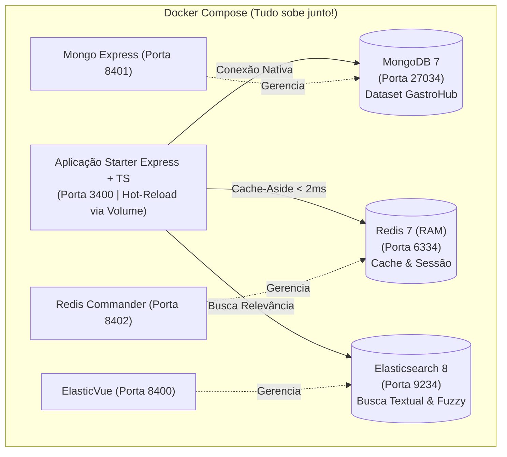

# Ambiente de Desenvolvimento NoSQL & Aplicação Starter

Ambiente integrado com **Docker**, **MongoDB**, **Redis**, **Elasticsearch**, interfaces visuais web e uma **aplicação Node.js + TypeScript conteinerizada com Hot-Reload** para a disciplina de **Banco de Dados NoSQL (TSI34E-TSI4)** da UTFPR Campus Guarapuava.

---

## 🏗️ Visão Geral da Arquitetura do Ambiente



---

## ⚡ Passo 1: Instalação e Configuração do Docker (Apenas 1 vez por máquina)

Se você está em um computador do laboratório ou no seu notebook com **Ubuntu / Linux Mint**, execute o instalador automatizado que configura todas as permissões de usuário:

```bash
# 1. Conceder permissão de execução aos scripts
chmod +x *.sh

# 2. Executar o instalador (ele solicitará sua senha apenas uma vez)
./setup.sh
```

### 🔑 Como funciona a permissão sem `sudo` no Ubuntu:
O script adiciona seu usuário ao grupo `docker` e ajusta as permissões do socket `/var/run/docker.sock`.
- **Se abrir um novo terminal e der erro de permissão**, basta rodar uma única vez:
  ```bash
  newgrp docker
  ```
  *(Ou faça logout e login na sua sessão do sistema)*.

---

## 🚀 Passo 2: Subir o Ambiente Completo com 1 Comando

Para subir todos os bancos, interfaces web **E** a aplicação Node/TypeScript juntos:

```bash
./iniciar.sh
```

> [!NOTE]
> O script `./iniciar.sh` possui um mecanismo que **libera automaticamente as portas antes de iniciar**, evitando qualquer erro de conflito de portas com outros serviços no Ubuntu.

---

## 🌐 Painéis e Acessos Web (Portas Dedicadas TSI34E)

Para evitar conflitos com outros programas locais do Ubuntu, utilizamos portas dedicadas:

| Serviço / Ferramenta | Endereço Web | Finalidade | Credenciais |
| :--- | :--- | :--- | :--- |
| **API Starter (Express + TS)** | [http://localhost:3400](http://localhost:3400) | Aplicação com hot-reload ativo | Sem autenticação |
| **ElasticVue (Elasticsearch)** | [http://localhost:8400](http://localhost:8400) | Interface visual para explorar índices e buscas | Conecta em `http://localhost:9200` |
| **Mongo Express (MongoDB)** | [http://localhost:8401](http://localhost:8401) | Visualizar coleções do banco **GastroHub** | Já conecta autenticado |
| **Redis Commander (Redis)** | [http://localhost:8402](http://localhost:8402) | Inspecionar chaves, TTLs e valores em memória | Sem necessidade de login |
| **MongoDB (Porta direta)** | `localhost:27034` | Conexão para Compass, DBeaver ou VS Code | `root` / `root` |
| **Redis (Porta direta)** | `localhost:6334` | Conexão direta TCP | Sem senha |
| **Elasticsearch (Porta direta)** | `http://localhost:9234` | Endpoint REST para queries | Sem SSL (Modo Dev Lab) |

---

## 📡 Endpoints Prontos para Testar

- **Health Check dos 3 Bancos:** [http://localhost:3400/api/health](http://localhost:3400/api/health)
- **Simple Collection (GET /api/itens):** [http://localhost:3400/api/itens](http://localhost:3400/api/itens)
  - *Dica:* Na 1ª requisição, você verá `origem: "MONGODB (Salvo no Redis por 60s)"`. Na 2ª requisição, você verá `origem: "REDIS_CACHE (< 2ms)"`!

---

## 🧑‍💻 Como Programar e Criar Novas Funções nas Aulas

Você **não precisa instalar o Node.js na sua máquina** se não quiser. O código da pasta `app/src/` está montado em tempo real no container Docker.

### 🔄 Hot-Reload Automático:
Quando você editar e salvar qualquer arquivo em `app/src/` no seu VS Code, o servidor dentro do Docker reinicia instantaneamente em menos de 1 segundo!

### Estrutura do Código em `app/src/`:

```
app/src/
├── database/            # Conexões prontas (Singletons)
│   ├── mongo.ts         # getDb(), getCollection("colecao")
│   ├── redis.ts         # getRedisClient(), cacheGet(), cacheSet()
│   └── elastic.ts       # getElasticClient()
├── controllers/         # Funções que tratam requisições e acessam os bancos
│   └── itens.controller.ts  # Controller com GET pronto e simples!
└── routes/              # Mapeamento de rotas HTTP
    ├── index.ts         # Health check e agregador
    └── itens.routes.ts  # Rota GET /api/itens
```

### Exemplo: Como adicionar uma nova função no controller

Abra `app/src/controllers/itens.controller.ts` e adicione seu método:

```typescript
import { Request, Response } from "express";
import { getCollection } from "../database/mongo.js";
import { cacheSet, cacheGet } from "../database/redis.js";

export class ItensController {
  // 1. Método que já vem pronto:
  static async listar(req: Request, res: Response): Promise<void> { ... }

  // 2. Novo método adicionado durante a aula:
  static async buscarPorCategoria(req: Request, res: Response): Promise<void> {
    try {
      const col = getCollection("itens");
      const categoria = req.params.categoria;
      const resultados = await col.find({ categoria }).toArray();
      res.json({ total: resultados.length, resultados });
    } catch (err: any) {
      res.status(500).json({ erro: err.message });
    }
  }
}
```

E registre a rota em `app/src/routes/itens.routes.ts`:

```typescript
router.get("/categoria/:categoria", ItensController.buscarPorCategoria);
```

Ao salvar o arquivo (`Ctrl + S`), teste em: `http://localhost:3400/api/itens/categoria/Pizzas`.

---

## 🛠️ Comandos de Manutenção

- **Ver logs da aplicação em tempo real:**
  ```bash
  docker compose logs -f app
  ```
- **Parar os containers (sem perder dados):**
  ```bash
  ./parar.sh
  ```
- **Resetar tudo para o estado original de fábrica (GastroHub limpo):**
  ```bash
  ./reset.sh
  ```
